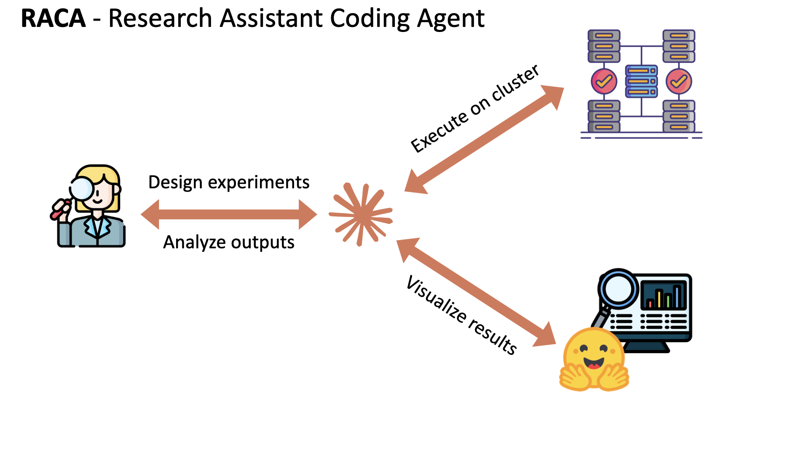
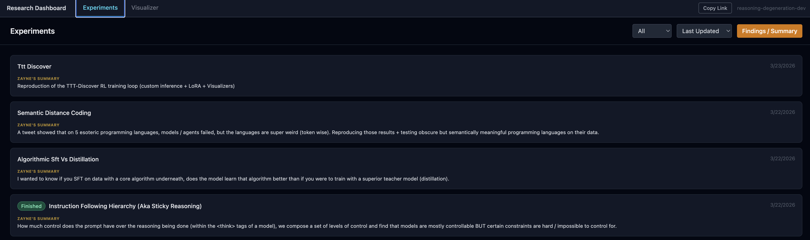

# RACA: Research Assistant Coding Agent

One Claude Code session: design experiments, run them on your compute, analyze the results.

```bash
curl -sSL https://raw.githubusercontent.com/Zayne-sprague/RACA/main/install.sh | bash
```



## What you type → what happens

**Design an experiment:**
> *I want to test whether Qwen3-8B follows complex instructions better than Llama-3.1-8B*

Claude designs the experiment, red-teams it for flaws, proposes a canary job, creates the experiment folder, and syncs your dashboard.

**Run it on your cluster:**
> *Run this on torch*

Claude finds available GPUs, writes the sbatch script, submits the job, monitors it, and uploads partial results to HuggingFace as they come in.

**Check on a running job:**
> *How's the experiment going?*

Claude SSHs into your cluster, checks job status, tails the logs, validates any new artifacts, and updates the dashboard — all without you touching a terminal.

**Analyze results:**
> *Show me what we got*

Claude pulls the results, samples outputs, compares against the hypothesis, writes findings to the experiment README, and gives you a link to the dashboard.

**Set up new compute:**
> *Connect my university cluster* or *Set up RunPod*

Claude walks you through it. You authenticate once with `raca auth <cluster>`, then just talk.

## How it works

Before RACA, Claude Code couldn't reach your cluster. You'd design an experiment in one window, SSH into your HPC in another, and hope nothing fell through the cracks.

RACA closes the loop. One session, one conversation: design → sanity-check → run → validate → results. Your compute stays where it is — RACA talks to it, catches mistakes before they waste GPU hours, uploads artifacts to HuggingFace as they come in, and keeps a live dashboard so you never wonder what's happening.


## What you get

- **SSH to any cluster** — Slurm, Runpod, or local GPUs. Authenticate once, talk from there.
- **Red-team review** — an adversarial agent checks your experiment design before any compute runs.
- **Live dashboard** — experiment READMEs, timelines, artifacts, results. Local or deployed to a free HuggingFace Space.
- **Artifact pipeline** — results upload to HuggingFace as they come in, validated automatically, visible on the dashboard immediately.
- **Resumable jobs** — short jobs that checkpoint and resume. Partial results stream to you throughout.



## Install

```bash
curl -sSL https://raw.githubusercontent.com/Zayne-sprague/RACA/main/install.sh | bash
```

Sets up your workspace, installs tools, then launches Claude Code. Claude walks you through connecting clusters, setting up HuggingFace, and deploying your dashboard. Takes about 5 minutes.

**Update:** `bash raca-update.sh` (in your workspace)
**Uninstall:** `bash raca-uninstall.sh`

## Starting RACA after install

Just `cd` into your workspace and run `claude`:

```bash
cd /path/to/your/workspace
claude
```

That's it. RACA picks up where you left off — clusters, experiments, everything. If your SSH sessions expired, reconnect with `raca auth <cluster>`.

## Read more

- [Commands & Skills](docs/commands-and-skills.md) — what RACA can do and how it works under the hood
- [Blog: How Claude Code Changed the Way I Think About Research](docs/blog/RELEASE.md)

## Optional plugins

RACA works on its own, but these make it better:

- **[Superpowers](https://github.com/anthropics/claude-code-plugins)** — structured planning, proactive design questions
- **[Agent-Deck](https://github.com/asheshgoplani/agent-deck)** — run multiple Claude sessions in parallel

## License

MIT
